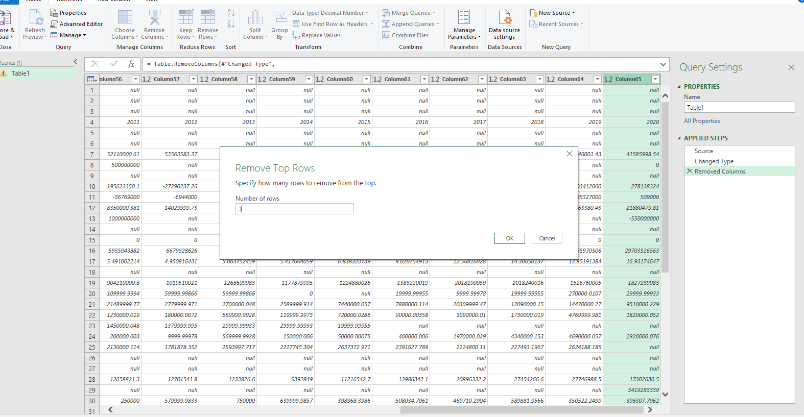

# Nigeria-s-Economic-Analysis

## Introduction:
This is a Power BI project to analyze Nigeria's Economy and derive insights on the economic trends and growth over the years from 2001-2020. The dataset was obtained from the World Bank via Kaggle.
Link to data: [here](data.worldbank.org/country/Ng)

## Problem Statement:
1. What is the GDP(current US$) and GNI(current US$) by year?
2. What are the Rural population, Urban population, and Population,total rates by year?
3. What is the fertility rate, total (births per woman) by year?
4. What is the relationship between the Import of goods (current US$) and Export of goods (current US$)?
5. What is the percentage of Trade(% of GDP), Agriculture, forestry, and fishing, value added (% of GDP) for the year 2011?

## Skills/Concepts demonstrated: 
- PowerQuery
- Page navigation 
- Filters
- Tooltips
- Button
- Dashboard

## Data preparation/cleaning:
1. The very large dataset of over 999 rows were cleaned and streamlined to get the following indices according to instructions;
- Years from 2001 – 2020
- Population (female)
- Imports of goods and services (current US$)
- Population, total
- GNI (Current US$)
- Rural population
- Life expectancy at birth, total(years)
- Trade (% of GDP)
- Access to electricity (% of the population)
- Gross national expenditure (current US$)
- Rural population (% of the total population)
- Fertility rate, total (births per woman)
- Gross domestic savings (% of GDP)
- Population, male
- Birth rate, crude (per 1,000 people)
- GDP (current US$)
- Urban population
- Air transport, freight (million ton-km)
- Surface area (sq. k m)
- Agriculture, forestry, and fishing, value added (% of GDP)
- Goods imports (BoP, Current US$)

2. Remove the top 3 rows

3. Transpose data, rows become columns and columns become rows

4. Use the first rows as headers

5. Remove unwanted columns

6. After Data cleaning and transformation, the final dataset contained 21 columns to work with

## Analysis:
1. What is the GDP(current US$) and GNI(current US$) by year?

GDP (current US$) and total  GNI (current US$) are positively correlated with each other. At 574,183,825,590, 2014 had the highest GDP (current US$) and was 726.77% higher than 2000, which had the lowest GDP (current US$) at 69,448,756,933. 2014 accounted for 8.54% of GDP (current US$).
GDP (current US$) and GNI (current US$) diverged the most when the YEAR was 2013, when GDP (current US$) were 25,776,285,080 higher than GNI (current US$).

2. What are the Rural population, Urban population, and Population,total rates by year?

Across all 21 years, Rural population ranged from 80,050,353 to 100,084,652, Urban population ranged from 42,801,631 to 108,242,753, and Population, total ranged from 122,851,984 to 208,327,405.

3. What is the fertility rate, total (births per woman) by year?

4. What is the relationship between the Import of goods (current US$) and Export of goods (current US$)

5. What is the percentage of Trade(% of GDP), Agriculture, forestry, and fishing, value added (% of GDP) for the year 2011?

## Visualization Dashboard:

## Conclusion:
Year 2000 had the lowest GDP(current US$) of 69,448,756,933.
Year 2014 had the highest GDP(current US$) of 574,183,825,590.
Year 2020 has the highest population with 208 Million people. 
Year 2011 recorded a Trade count of 53, Gross Domestic Savings count of 25 and Value Added count of 22.

## Recommendations:
1. Developing human capital, enhancing productivity of labour through training, technology, improving infrastructure can improve the overall GDP thereby contributing to economic growth.
2. Encouraging family planning, Reproductive Health awareness to women, and access to quality healthcare can ensure sustainable population growth and overall improve health and well-being of mothers and children.
